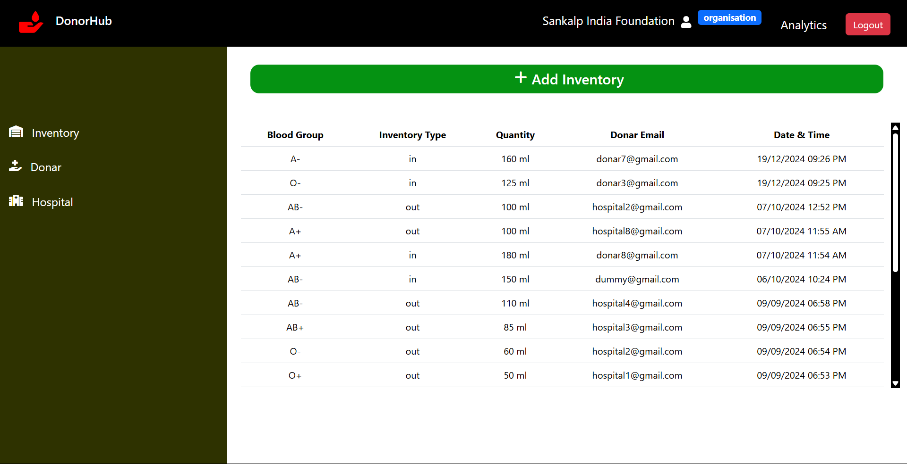
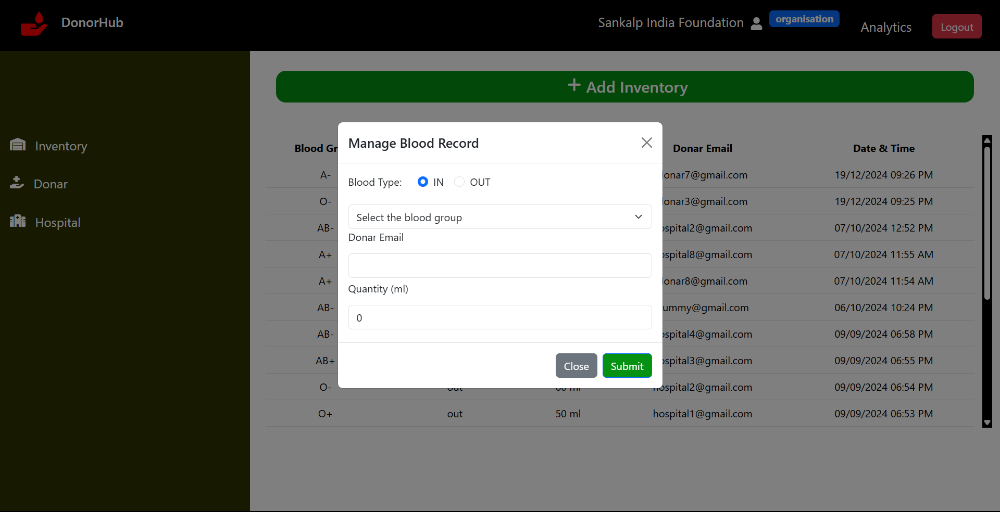
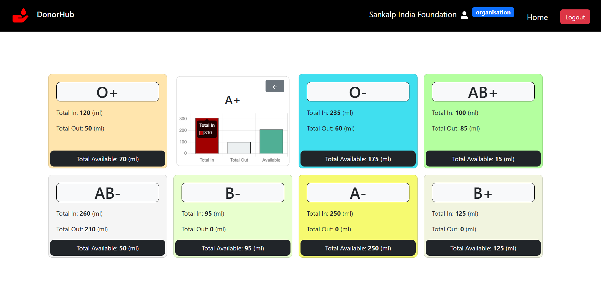
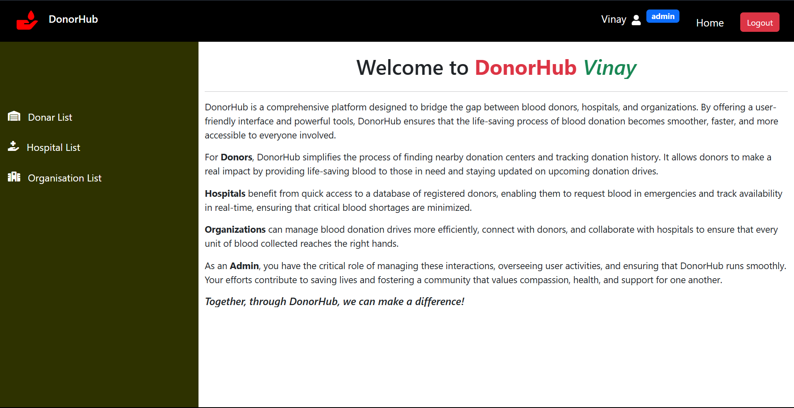
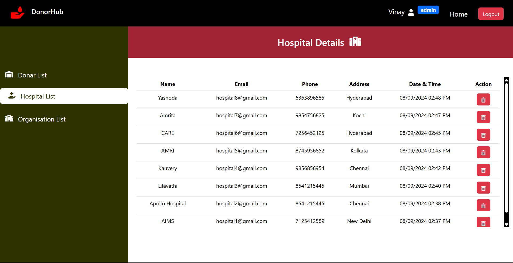
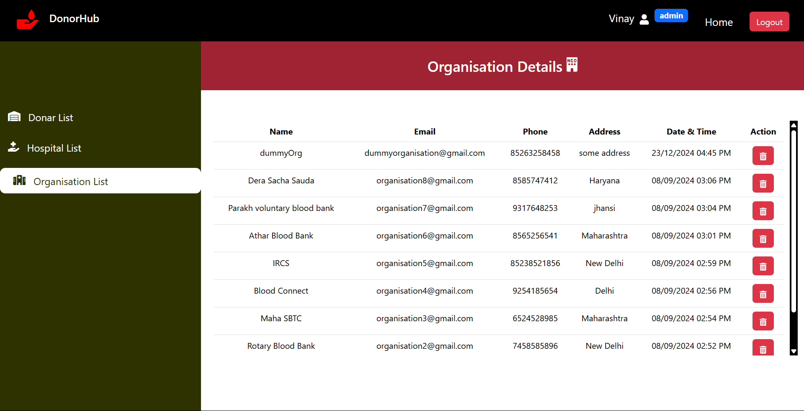

# DonorHub

DonorHub, a platform that simplifies blood donation by connecting donors, hospitals, and organizations. The platform enables organizations and NGOs to manage blood records online, moving away from traditional Excel sheets.

Consists of 4 different users -- **Donar**,**Hospital**,**Organisation** and **Admin**

## Demo

https://drive.google.com/file/d/1nbKGp5kxYeb5fJrXE_WzwfU8UcCOqVBp/view?usp=sharing

## Salient Features

- 4 different dashboards (Donar,Hospital,Organisation,Admin)
- Analytics Dashboard to analyse Blood Records
- Secured Authentication using JWT
- Role based Authentication and Access Control System
- REST API for performing CRUD Operations

## Functionalities in each dashboard

**_Organisations Dashboard:_**

Upon successfull SignUp and Login,

- Organisations can view all the blood records
  

- Organisations can add the blood-in and blood-out data
  

- Organisations can analyse the blood records using **_Analytics Page_**
  

- Organisations can monitor the details of Donars
  
- Organisations can monitor the detais of hospitals
  

**_Donar Dashboard:_**

Upon successfull SignUp and Login, Donar is able to monitor the detials of organisations that he/she had donated and also the details of donations that he/she has done so far.

**_Hospital Dashboard:_**

Upon successfull SignUp and Login, Hospital is able to monitor the list of organisations that it is associated with and also the list of consumers details who has utilised the blood so far.

**_Admin Dashboard:_**



- Admin can monitor Details of Donars
  

- Admin can monitor Details of hospitals
  

- Admin can monitor Details of Organisations
  

- Admin can also delete any of donars, hospitals and organisations if required.

## Install Packages and Run the App

After successfully cloning my GitHub Repo, type the below command in integrated terminal in the same directory as that of the project.

```bash
  npm i
```

The above command ensures to install all the required packages.

Repeat the above process in client directory too.

From root directory type the below command to run the application

```bash
  npm run dev
```

## API Reference

#### Login API

```http
  POST /api/v1/auth/login
```

| Parameter  | Type     | Description                    |
| :--------- | :------- | :----------------------------- |
| `email`    | `string` | **Required**. Email of user    |
| `password` | `string` | **Required**. Password of user |
| `role`     | `string` | **Required**. Role of user     |


#### REGISTER API

```http
  POST /api/v1/auth/register
```

| Parameter  | Type     | Description                        |
| :--------- | :------- | :--------------------------------- |
| `role`     | `string` | **Required**. Role of user         |
| `name`     | `string` | **Required**. Name of user         |
| `email`    | `string` | **Required**. Email of user        |
| `password` | `string` | **Required**. Password of user     |
| `address`  | `string` | **Required**. Address of user      |
| `phone`    | `string` | **Required**. Phone Number of user |


#### GET Curent User API

```http
  GET /api/v1/auth/current-user
```

- After Successful Login, Get token from Browser's local storage
- Use the token in the header of the API

| Key             | Value            | Description                                          |
| :-------------- | :--------------- | :--------------------------------------------------- |
| `Authorization` | `Bearer {token}` | **Required**. Get token from browser's local storage |


#### CREATE-INVENTORY API

```http
  POST /api/v1/inventory/create-inventory
```

| Parameter           | Type     | Description                                |
| :------------------ | :------- | :----------------------------------------- |
| `email`             | `string` | **Required**. Email of user                |
| `inventoryType`     | `string` | **Required**. in/out (bloodIn or bloodOut) |
| `bloodGroup`        | `string` | **Required**. Blood-Group of user          |
| `quantity`          | `string` | **Required**. Quanitity of Blood           |
| `donar`             | `string` | **Required**. Id of Donar                  |
| `organisation`      | `string` | **Required**. Id of Organisation           |
| `organisatioinName` | `string` | **Required**. Name of Organisation         |

- After Successful Login, Get token from Browser's local storage
- Use the token in the header of the API

| Key             | Value            | Description                                          |
| :-------------- | :--------------- | :--------------------------------------------------- |
| `Authorization` | `Bearer {token}` | **Required**. Get token from browser's local storage |


#### GET Inventory API

```http
  GET /api/v1/inventory/get-inventory
```

| Parameter      | Type     | Description                      |
| :------------- | :------- | :------------------------------- |
| `organisation` | `string` | **Required**. Id of Organisation |

- After Successful Login, Get token from Browser's local storage
- Use the token in the header of the API

| Key             | Value            | Description                                          |
| :-------------- | :--------------- | :--------------------------------------------------- |
| `Authorization` | `Bearer {token}` | **Required**. Get token from browser's local storage |


#### GET DonarList API

```http
  GET /api/v1/inventory/get-donar
```

- After Successful Login, Get token from Browser's local storage
- Use the token in the header of the API

| Key             | Value            | Description                                          |
| :-------------- | :--------------- | :--------------------------------------------------- |
| `Authorization` | `Bearer {token}` | **Required**. Get token from browser's local storage |


#### GET HospitalList API

```http
  GET /api/v1/inventory/get-hospital
```

- After Successful Login, Get token from Browser's local storage
- Use the token in the header of the API

| Key             | Value            | Description                                          |
| :-------------- | :--------------- | :--------------------------------------------------- |
| `Authorization` | `Bearer {token}` | **Required**. Get token from browser's local storage |


#### GET OrganisationList API for Donor

```http
  GET /api/v1/inventory/get-organisation
```

- After Successful Login as Donor, Get token from Browser's local storage
- Use the token in the header of the API

| Key             | Value            | Description                                          |
| :-------------- | :--------------- | :--------------------------------------------------- |
| `Authorization` | `Bearer {token}` | **Required**. Get token from browser's local storage |


#### GET OrganisationList API for Hospital

```http
  GET /api/v1/inventory/get-organisation-for-hospital
```

- After Successful Login as Hospital, Get token from Browser's local storage
- Use the token in the header of the API

| Key             | Value            | Description                                          |
| :-------------- | :--------------- | :--------------------------------------------------- |
| `Authorization` | `Bearer {token}` | **Required**. Get token from browser's local storage |


#### GET Analytics data for Organisation API

```http
  GET /api/v1/analytics/bloodGroups-data
```

- After Successful Login as Organisation, Get token from Browser's local storage
- Use the token in the header of the API

| Key             | Value            | Description                                          |
| :-------------- | :--------------- | :--------------------------------------------------- |
| `Authorization` | `Bearer {token}` | **Required**. Get token from browser's local storage |


#### GET DonarList API for Admin

```http
  GET /api/v1/admin/donar-list
```

- After Successful Login as Admin, Get token from Browser's local storage
- Use the token in the header of the API

| Key             | Value            | Description                                          |
| :-------------- | :--------------- | :--------------------------------------------------- |
| `Authorization` | `Bearer {token}` | **Required**. Get token from browser's local storage |


#### GET HospitalList API for Admin

```http
  GET /api/v1/admin/hospital-list
```

- After Successful Login as Admin, Get token from Browser's local storage
- Use the token in the header of the API

| Key             | Value            | Description                                          |
| :-------------- | :--------------- | :--------------------------------------------------- |
| `Authorization` | `Bearer {token}` | **Required**. Get token from browser's local storage |


#### GET OrganisationList API for Admin

```http
  GET /api/v1/admin/organisation-list
```

- After Successful Login as Admin, Get token from Browser's local storage
- Use the token in the header of the API

| Key             | Value            | Description                                          |
| :-------------- | :--------------- | :--------------------------------------------------- |
| `Authorization` | `Bearer {token}` | **Required**. Get token from browser's local storage |


#### DELETE Donar API for Admin

```http
  DELETE /api/v1/admin/delete-donar/:id
```

- After Successful Login as Admin, Get token from Browser's local storage
- Use the token in the header of the API
- Pass the Id of the donar as Params in API

| Key             | Value            | Description                                          |
| :-------------- | :--------------- | :--------------------------------------------------- |
| `Authorization` | `Bearer {token}` | **Required**. Get token from browser's local storage |


#### DELETE Hospital API for Admin

```http
  DELETE /api/v1/admin/delete-hospital/:id
```

- After Successful Login as Admin, Get token from Browser's local storage
- Use the token in the header of the API
- Pass the Id of the hospital as Params in API

| Key             | Value            | Description                                          |
| :-------------- | :--------------- | :--------------------------------------------------- |
| `Authorization` | `Bearer {token}` | **Required**. Get token from browser's local storage |


#### DELETE Organisation API for Admin

```http
  DELETE /api/v1/admin/delete-organisation/:id
```

- After Successful Login as Admin, Get token from Browser's local storage
- Use the token in the header of the API
- Pass the Id of the organisation as Params in API

| Key             | Value            | Description                                          |
| :-------------- | :--------------- | :--------------------------------------------------- |
| `Authorization` | `Bearer {token}` | **Required**. Get token from browser's local storage |


