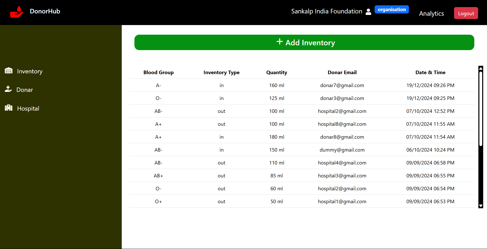
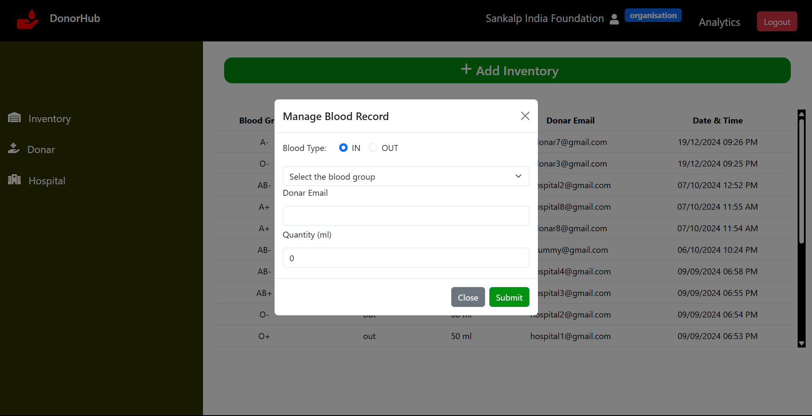
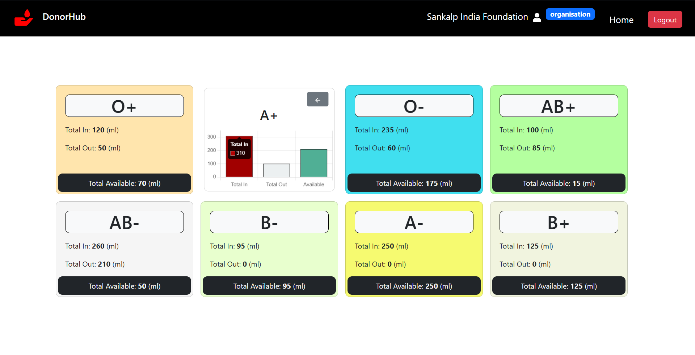
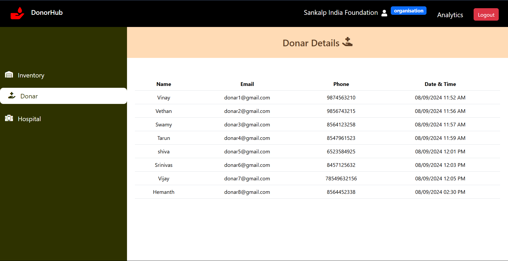
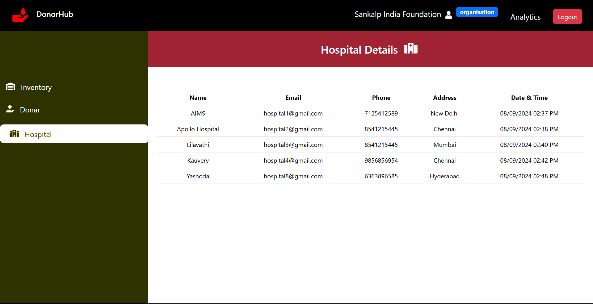
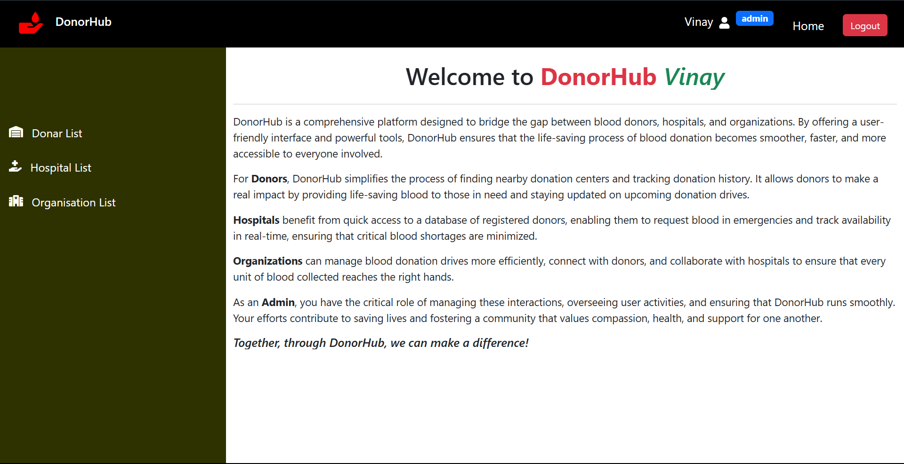
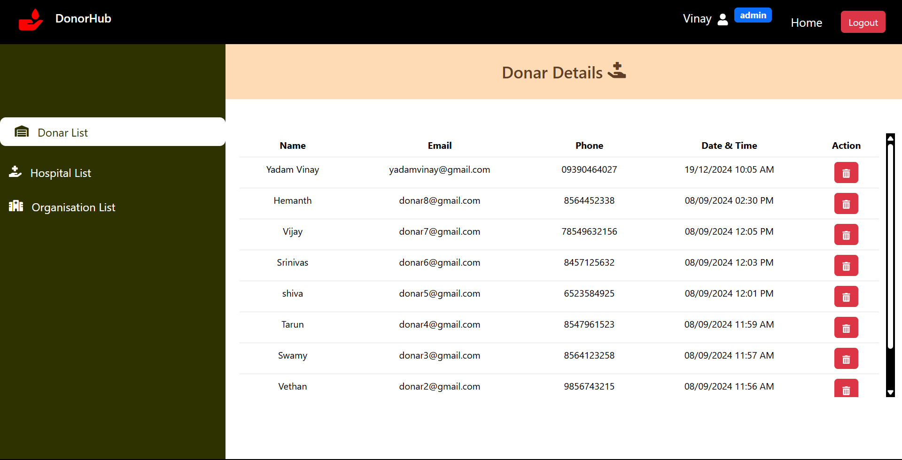
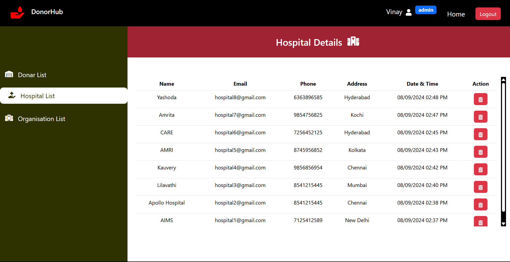
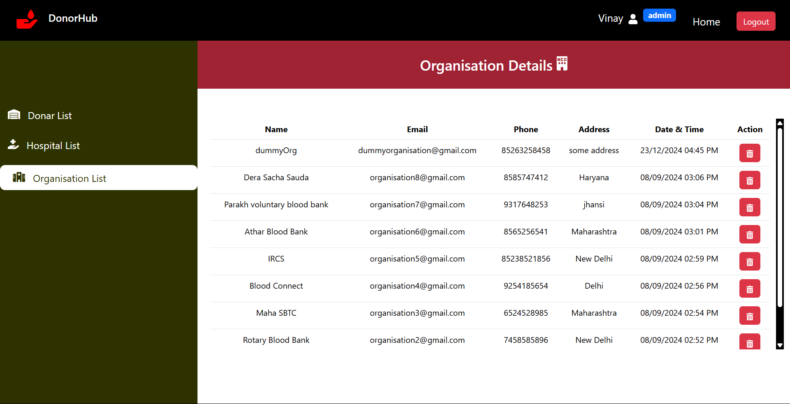

# DonorHub

DonorHub, a platform that simplifies blood donation by connecting donors, hospitals, and organizations. The platform enables organizations and NGOs to manage blood records online, moving away from traditional Excel sheets.

Consists of 4 different users -- **Donar**,**Hospital**,**Organisation** and **Admin**

## Demo

https://drive.google.com/file/d/1nbKGp5kxYeb5fJrXE_WzwfU8UcCOqVBp/view?usp=sharing

## Salient Features

- 4 different dashboards (Donar,Hospital,Organisation,Admin)
- Analytics Dashboard to analyse Blood Records
- Secured Authentication using JWT
- Role based Authentication and Access Control System

## Functionalities in each dashboard

**_Organisations Dashboard:_**

Upon successfull SignUp and Login, Organisations

- can view all the blood records
  

- can add the blood-in and blood-out data
  

- can analyse the blood records using **_Analytics Page_**
  

- can monitor the details of Donars
  
- can monitor the detais of hospitals
  

**_Donar Dashboard:_**

Upon successfull SignUp and Login, Donar is able to monitor the detials of organisations that he/she had donated and also the details of donations that he/she has done so far.

**_Hospital Dashboard:_**

Upon successfull SignUp and Login, Hospital is able to monitor the list of organisations that it is associated with and also the list of consumers details who has utilised the blood so far.

**_Admin Dashboard:_**



- Admin can monitor Details of Donars
  

- Admin can monitor Details of hospitals
  

- Admin can monitor Details of Organisations
  

- Admin can also delete any of donars, hospitals and organisations if required.

## Install Packages and Run the App

After successfully cloning my GitHub Repo, type the below command in integrated terminal in the same directory as that of the project.

```bash
  npm i
```

The above command ensures to install all the required packages.

Type the below command to run the application

```bash
  npm start
```
